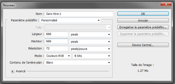
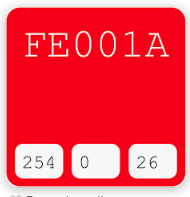

# red_skull.gif

C'est ma première animation et premier travail pratique pour ma préparation à l'intégration d'une formation "animation 2D/ monteur vidéo".

La demande du client virtuel: Créer une animation GIF carré de 666 pixels, rouge Coca, une tête de mort [(fournie)](./img/fposter,small,wall_texture,product,750x1000.u2.png) apparait puis disparait.

Je me suis servi de photoshop CS4 pour créer les images constituant l'animation. Puis un Web-générateur de GIF: [gifmaker](https://ezgif.com/maker)

## Mes étapes

J'ai créer un nouveau document.

Google m'as fournis rapidement de code RVB du rouge coca.

